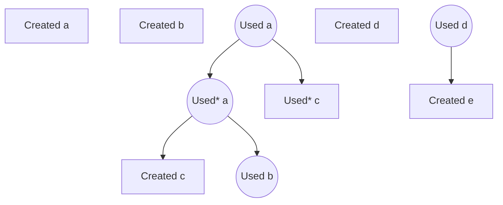

# Events

They are of two types:

- `Created` events which have no consequences.
- `Used` events which potentially have a number of ordered consequences.

each event is associated with a token.

# Event Ordering

- We can represent the consequences of an event as its children in a tree structure where the events are ordered from left to right. 

    ```mermaid
    graph TB
        A
        B
        C((C)) --> CA((CA))
        CA --> CAA
        CA --> CAB((CAB))
        C --> CB
        D
        E((E)) --> EA
    ```
  They are understood to happen in this order:

    ```mermaid
    graph TB
        A[1]
        B[2]
        C((3)) --> CA((4))
        CA --> CAA[5]
        CA --> CAB((6))
        C --> CB[7]
        D[8]
        E((9)) --> EA[10]
    ```

# Event Causality

The events have been represented with the two shapes:

- rectangle representing `Created` events 
- circle representing `Updated` events

We don't have to distinguish between the `consumed` cases of the `Used events` as far as the shapes are concerned, but we can use `Used* X` to emphasize that `X` token was consumed and is not to appear again.

Continuing with our previous example, we can add the token Ids to paint a better picture of what's going on:



Observe that:

- Used events have a created event with the same token Id behind them in the chronological order. ie token id `b` appears in two events:
  - event `Created b`, ie the 2nd event.
  - event `Used b`, ie the 6th event.
- The tokens don't have to be used in the same order that they were created. ie, whereas token `c` is created after token `b`, it is in fact used before it.
- **It appears** that as far as this problem is concerned, there is no restriction on the `Created` event associated with a `Used` event being in its descendants. ie, `Used b` 's only descendants in terms of the tree structure are `[Used a, Used* a]` and `Created b` is not a descendant of the tree structure.
- After token `a` was used AND consumed, in the 4th event, it does not appear in the subsequent events.

# Event Audit

In the above case

- token `a` is consumed in the process.
- token `b` is used but not consumed.
- token `c` is consumed in the process.
- token `d` is used but not consumed.
- token `e` is never even consumed.

as such, the active set of tokens, in order of creation (alphabetic, by construction) are:

- `b`
- `d`
- `e`